# 환경부 웹 어플리케이션
Spring legacy + Oracle + MyBatis + Spring tx + Spring security + JSON + AOP

## :clipboard: 프로젝트 개요

- "환경부" 라는 정부 부처를 주제로 Spring Legacy MVC 프로젝트
- Maven으로 빌드하였으며, Spring Security, MyBatis 등을 활용하여 회원가입, 로그인, 게시판 글 작성, 수정, 삭제 등의 기능 구현

## ⚙ 개발 환경
- 운영체제 : Windows 11
- 개발환경(IDE) : STS3
- JDK 버전 : JDK 1.8
- 데이터 베이스 : Oracle
- 빌드 툴 : Maven
- 관리 툴 : GitHub

## 🛠Dependencies
- Lombok
- OracleDB Driver
- Spring Security
- Mybatis
- Commons Logging
- Inject
- Servlet
- junit
- JSON

## ⚙편집기
- STS3 

## 클래스 설계
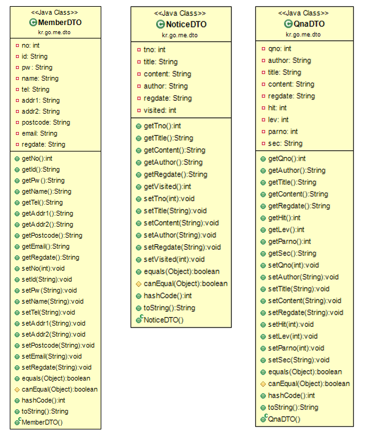

## DB 설계
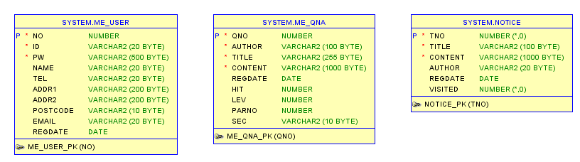

## 💻기능 구현
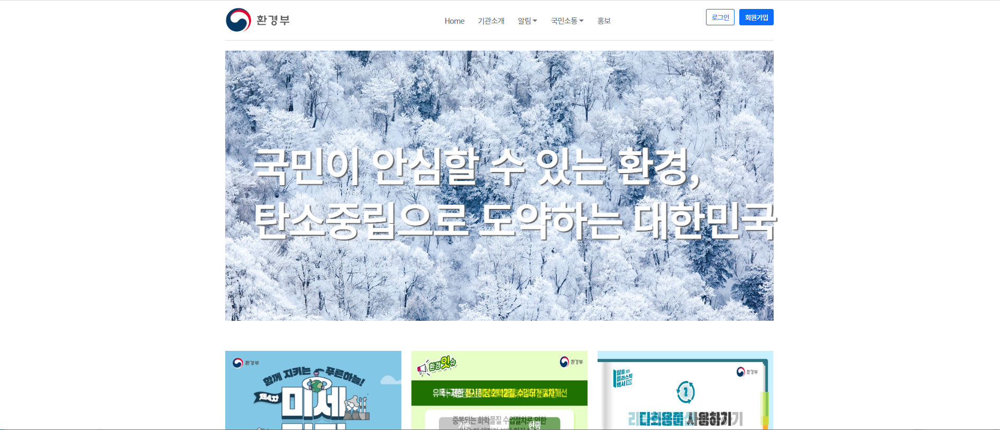
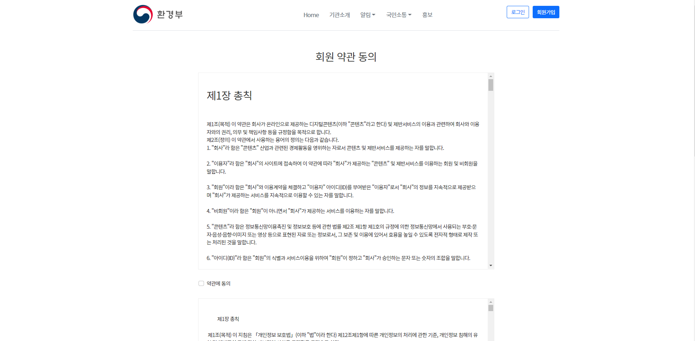
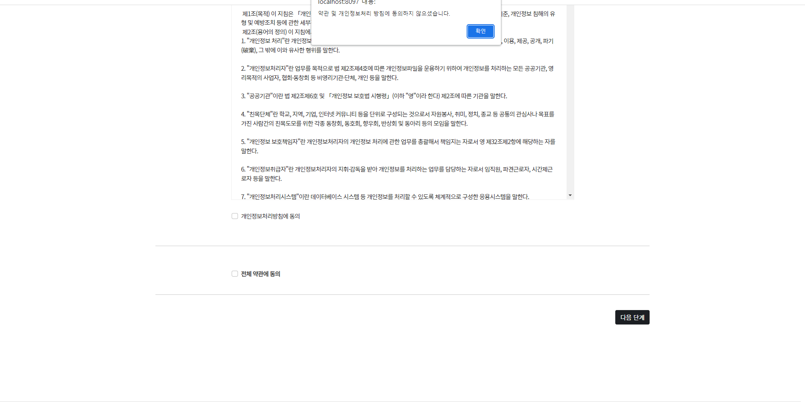
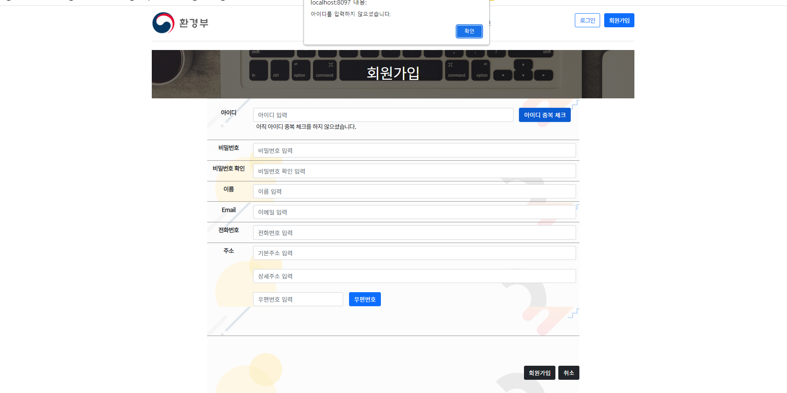
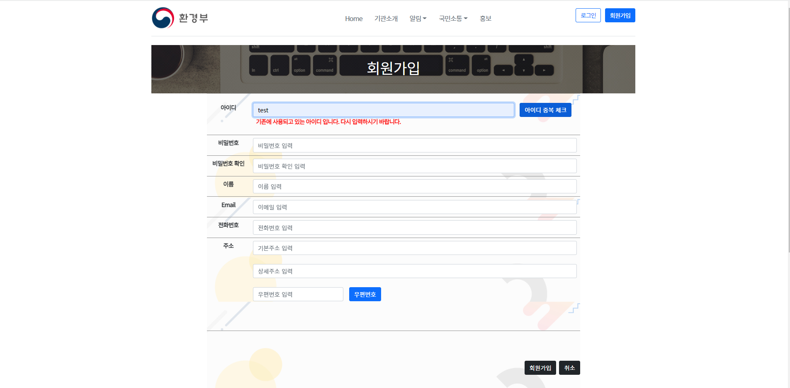
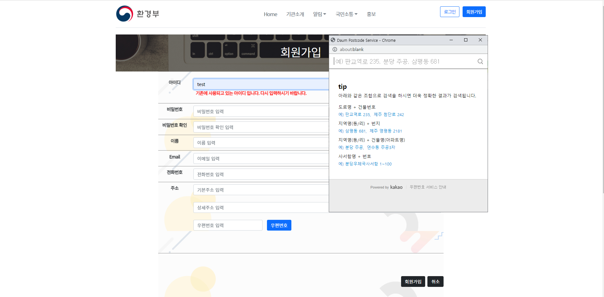

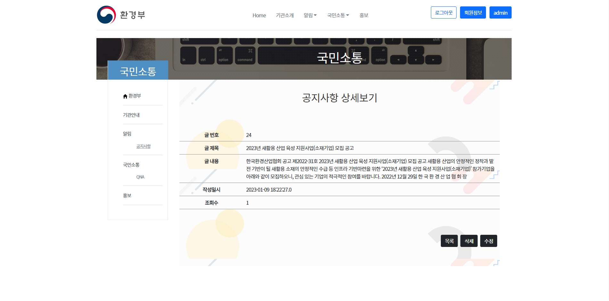
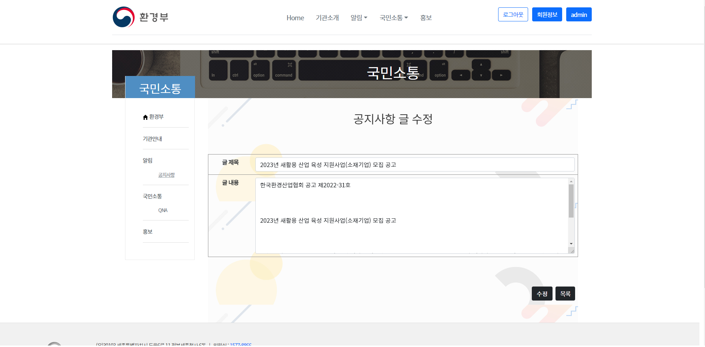
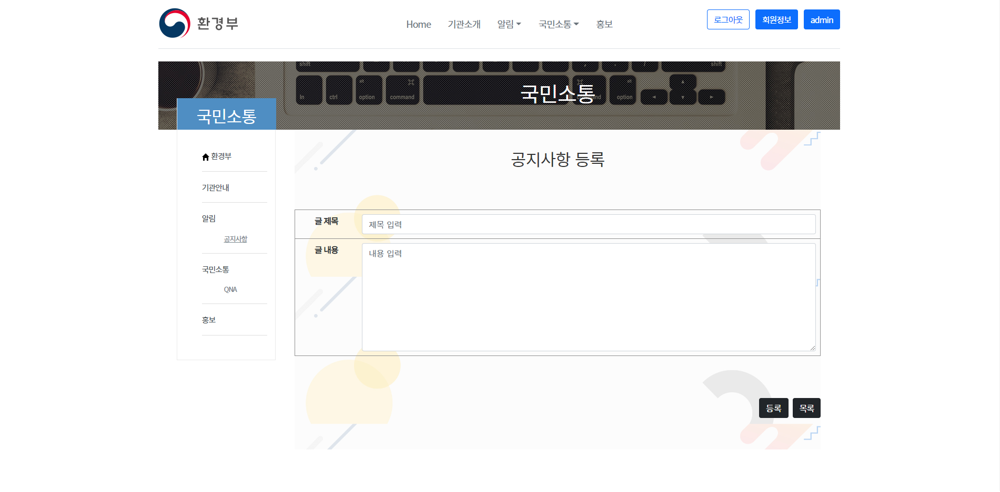
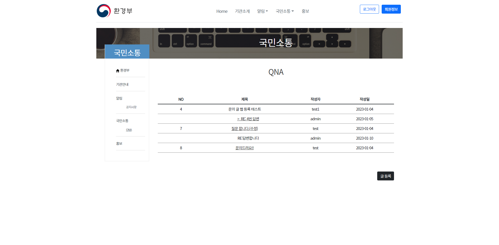
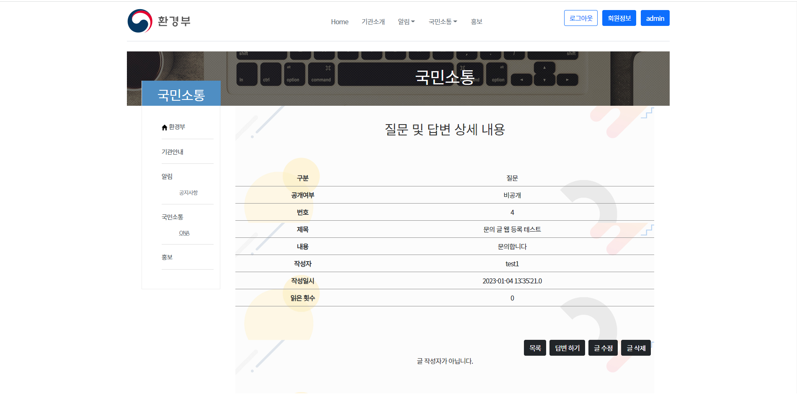
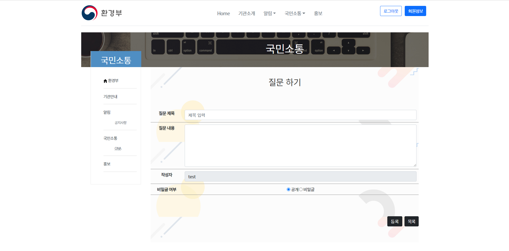
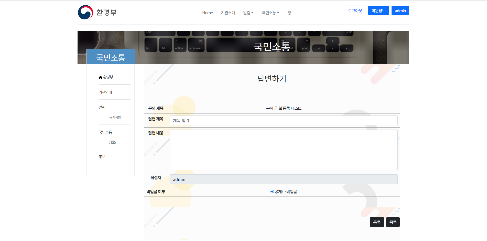
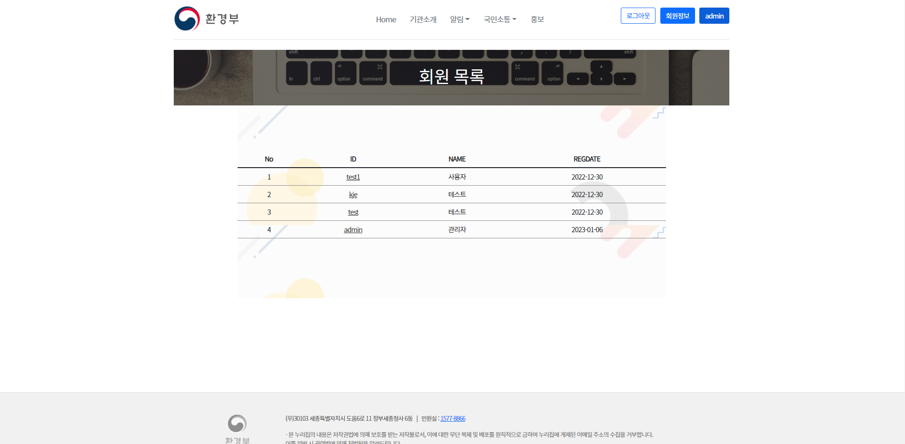
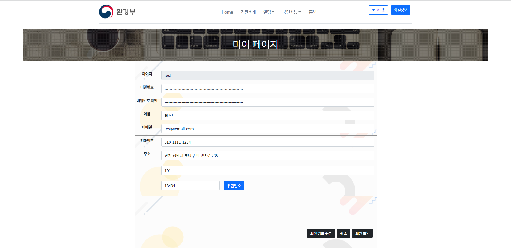

